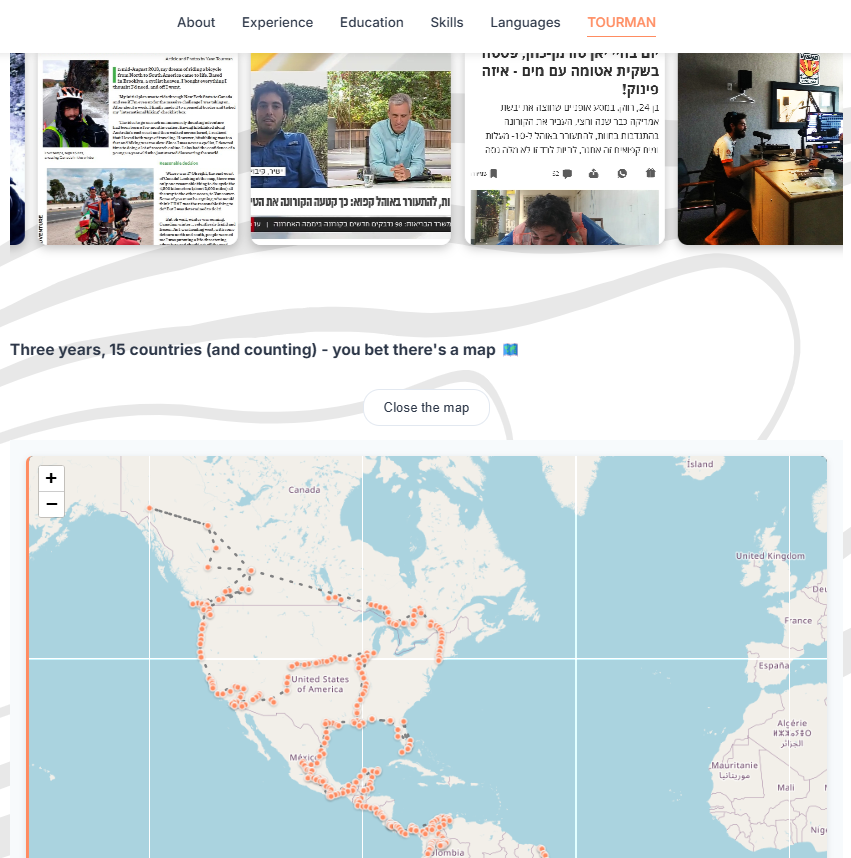

# Yann Cohen - Personal Website

This repository contains the source code for my personal website, **[Yann Cohen](https://iamyannc.github.io/Yann-dev/)** ---

## About

I’m **Yann Cohen**, a data analyst and aspiring web developer - and also an adventurer currently cycling from **Alaska to Argentina**.  
This website is my **first real project** using **HTML**, **CSS**, and **JavaScript**, created from scratch to touch front-end development.

---

## What You’ll Find

- **Interactive world map** showing every place I’ve passed through on my trip  
- **Photo and text carousels** describing key moments and milestones  
- **Sections** about my background, projects, and experiences on the road  

I’m most proud of implementing logic that detects the browser’s language and automatically redirects the user to the site’s French version - even before the DOM reloads - while also storing preferences in local storage so users who choose English aren’t rerouted again.  

My mom is happiest with the addition of the **interactive map** that shows all the places I’ve traveled through. For her, as a non-techy person, it would have taken a long time to gather that data one by one (whereas I just used ChatGPT to do it for me - just like this very README).

---

## Repository Structure

The project is organized for clarity and maintainability as it grew:

| Path / File | Purpose |
|--------------|----------|
| `index.html` | Main website in English. |
| `fr/index.html` | French version of the main page. |
| `css/` | Contains all stylesheets. Each major section (map, Tourman intro, animations) has its own file for easier updates. |
| `js/main.js` | Core JavaScript for interactivity, including map initialization and section toggles. |
| `tourman-img/` | Image assets for the “Tourman” sections and carousels. |
| `pdf/` | Contains downloadable documents such as my CV or trip resources. |
| `bg.svg`, `logo.jpg` | Global visual assets used site-wide. |

As the project expanded, I **split UI elements and sections** (map, text areas, portrait cards, and carousels) into dedicated CSS files (`map.css`, `tourman.css`, etc.) to keep the structure clear and modular.

---

## Tech Stack

- **HTML**  
- **CSS**  
- **JavaScript**  
- **Leaflet.js** for mapping  
- **Font Awesome** for icons  
- **uiverse.io** for UI elements  
- **ChatGPT** & **Claude**

---

## Notes

I’m new to web design, and I couldn’t have taken on this project without the assistance of modern AI technologies.  
My background as a data analyst and web app/package developer in the R programming language was crucial for asking the right questions.  
We truly live in a great era.

---

© Yann Cohen - 2025
